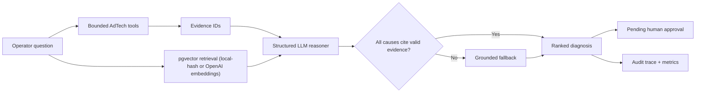
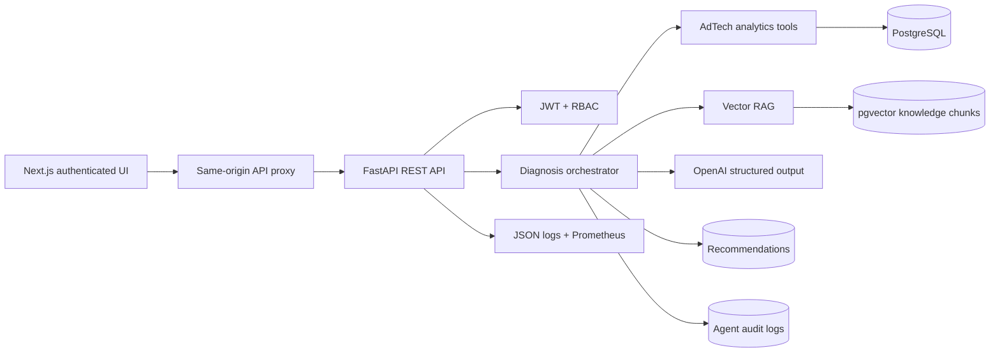

# SignalOps AI

### AI-powered campaign delivery intelligence workflow for AdTech operations teams

SignalOps AI helps campaign operations teams detect delivery risk, diagnose root causes with campaign data and AdOps playbooks, generate client-safe explanations, route recommendations through human approval, and preserve governance records. It combines bounded AdTech analytics tools, vector-retrieved operating playbooks, structured LLM reasoning, evidence validation, human approval, and an audit trail — moving a team from **"this campaign is behind"** to an inspectable root cause and an approved recovery action.

This is a working product case study — an enterprise-style MVP and portfolio demo, not a chat interface placed over hardcoded answers, and not a claim of production-scale usage.

> **Naming note:** the repository, Vercel project, Render service, and Neon database keep the historical technical name `adops-signal` to avoid breaking deployment URLs and existing infrastructure. The product itself is branded **SignalOps AI** everywhere a user or reviewer sees it (UI, docs, demo).

**[Open the public demo (no sign-in)](https://adops-signal.vercel.app/demo)** · **[Full workflow login](https://adops-signal.vercel.app)** · [Backend readiness](https://adops-signal.onrender.com/ready) · [GitHub / local setup](#local-setup)

[Watch the two-minute narrated demo](./docs/demo/adops-signal-2-minute-demo.mp4) · [Read the PRD](./docs/PRD.md) · [Explore the system diagrams](./docs/SYSTEM_DIAGRAMS.md) · [Review the evaluation](./docs/EVALUATION_REPORT.md)

> **Demo mode:** The recorded demo intentionally runs without an API key and visibly reports `fallback`. Add `OPENAI_API_KEY` to activate structured `llm_rag` diagnosis. Both modes use the same evidence tools, provenance contract, approvals, and audit system.

> **Cold start note:** the backend runs on Render's free tier, which can take up to ~60 seconds to wake from idle. The frontend detects this and shows a "waking up" retry state instead of a broken page — give the first request a moment.

## Public Portfolio Demo

- **Public demo (no sign-in):** [https://adops-signal.vercel.app/demo](https://adops-signal.vercel.app/demo)
- **Full workflow login:** [https://adops-signal.vercel.app](https://adops-signal.vercel.app) (demo credentials in [Local Setup](#local-setup))

`/demo` opens straight into the same dashboard as the full product, pre-authenticated as a read-only viewer against the seeded demo dataset. A persistent banner ("Public portfolio demo · sample data · read-only workspace") marks every page. From there, a visitor can browse the risk queue, open any campaign, run a real investigation - bounded tools, RAG playbook retrieval, and structured LLM-or-fallback reasoning, exactly the pipeline the full product uses - generate a client-safe brief, and read the Governance Record.

What the public session cannot do: approve or reject a recommendation, or write anything to the shared demo database. Diagnoses run for real, but for this role the agent skips both the audit-log write and the recommendation upsert (see `persist` in `backend/app/agent/signal.py`), so anonymous traffic can never pollute the seed data the full-login walkthrough depends on. Clicking Approve/Reject shows "Public demo is read-only. Use the full demo login for approval actions." instead of a disabled button.

### 90-second public demo click-through

1. Open `/demo` - the dashboard loads directly, no login screen, read-only banner visible.
2. Open the highest-risk campaign and run **Diagnose** - tools called, RAG playbook evidence, confidence, and execution mode (`llm_rag` or grounded fallback) are all real, not staged.
3. Generate the **client-safe brief** and note the line stating what it omits and why.
4. Open **Decision Queue** - approve/reject controls are replaced by a note pointing to the full login.
5. Open **Governance Record** - the real audit history and human decisions from the full-login workflow are visible, read-only.

## The Product Problem

CTV campaign underdelivery is a cross-system reasoning problem. An operator may need to combine:

- pacing against the flight plan;
- country, device, category, and publisher eligibility;
- available CTV or HbbTV supply;
- creative approval and VAST runtime quality;
- bid prices and publisher floors;
- frequency-cap pressure;
- late launch or missing delivery days;
- shared inventory consumed by higher-priority campaigns.

The operational cost is not only investigation time. Slow diagnosis puts booked media, client trust, and makegood exposure at risk.

## Product Thesis

An AI assistant is valuable here only if it:

1. retrieves facts from bounded platform tools;
2. distinguishes campaign evidence from general operating guidance;
3. cites evidence for every root cause;
4. exposes model mode, latency, sources, and confidence;
5. keeps delivery-impacting actions behind human approval;
6. remains available when the model provider is unavailable.

## End-To-End Operator Workflow

1. **Prioritize:** the delivery operations queue ranks campaigns by risk and pacing exposure.
2. **Diagnose:** bounded platform tools collect pacing, targeting, inventory, creative, VAST, and auction evidence before reasoning begins.
3. **Communicate:** the investigation produces a client-safe brief that omits internal pricing and raw technical traces.
4. **Decide:** an authorized operator approves or rejects each proposed action with a required rationale.
5. **Verify:** the governance record joins model execution, evidence provenance, confidence, human decision, reviewer, and timestamp.

These are implemented handoffs, not presentation-only concepts. A browser-tested workflow runs from Campaign 1048 in the risk queue through diagnosis, client brief, controlled approval, and the resulting audit record.

## Product Walkthrough

### Campaign health

Operators start with portfolio risk, not a blank chat box.


### Campaign operating context

Pacing, eligible supply, bid performance, creative state, and setup are visible before diagnosis.


### Evidence-backed diagnosis

The response contains ranked causes, evidence IDs, recommendations, confidence, tools called, retrieved playbooks, model mode, and latency.


### Creative quality

Approval state and runtime VAST quality remain separate. An approved asset can still require review because of timeout or media errors.


### Human decision control

Recommended changes enter a campaign-filtered queue. Approval or rejection requires operator rationale.


### Governance record

Agent traces and human decisions remain distinct, inspectable events.


### Business case

The value model is transparent and editable rather than presented as invented realized savings.


## Primary Users

| User | Decision supported |
|---|---|
| AdOps Manager | What is preventing delivery, and which action should we take? |
| Publisher Operations | Is the issue supply, request filtering, device mapping, or creative quality? |
| Customer Success | How do we explain the issue without exposing internal auction mechanics? |
| Product Manager | Which recurring failures deserve a platform investment? |

## How The Agent Works



### Tool layer

- Campaign summary (identity, flight dates, delivery, risk level).
- Campaign pacing.
- Campaign setup and launch timing.
- Targeting eligibility.
- Inventory/request failure distribution.
- Portfolio-level high-priority inventory pressure.
- Creative approval and VAST validation.
- Bid/floor competitiveness.
- Vector documentation retrieval.

Every diagnosis response returns the campaign ID, ranked root causes with evidence IDs, confidence, risk level, recommended actions, the exact tool names called, the playbook sources used, and the execution mode (`llm_rag` or `fallback`) — the full path from campaign data to evidence-backed diagnosis is inspectable, not just the final sentence.

The bounded tool set is also enumerable at `GET /api/agent/tools`, described in an MCP-compatible shape (name, description, input schema, output contract) — see [Tool Registry And MCP](#tool-registry-and-mcp) below.

### Reasoning layer

When configured, `gpt-5.4-mini` receives compact campaign context, evidence IDs, and retrieved guidance. It must return the strict `GroundedDiagnosis` schema. Causes with invalid evidence references are discarded. The prompt also guards against fake certainty and against blaming a specific publisher or partner unless the evidence directly supports it.

The model does not receive a database connection, credentials, or an action-execution tool.

### Availability fallback

Without a provider key, or when the provider fails, the application returns a clearly marked deterministic diagnosis. This is a resilience path, not the primary production reasoning mode. Both modes call the same bounded tools and the same RAG retrieval — only the synthesis step differs — so `execution_mode` in the API/UI is the only thing that changes, not the evidence trail.

## Tool Registry And MCP

The agent's internal tool surface is intentionally small (ten bounded tools, one internal consumer). `backend/app/agent/tool_registry.py` declares every existing agent tool in an MCP-compatible descriptor shape (`name`, `description`, `input_schema`, `output_contract`), served read-only at `GET /api/agent/tools`.

The `mcp-governance-v1` branch adds a first minimal MCP server milestone under `mcp-server/`. It exposes two read-only tools, `ping_adops_signal` and `get_campaign_health`, and reuses the existing backend campaign health service rather than introducing a parallel analytics path. See [MCP Local Setup](./docs/mcp-local-setup.md) for local install and test commands.

The backend also includes MCP governance persistence for agent runs, MCP tool calls, approval requests, policy checks, and blocked actions. See [MCP Governance Backend API](./docs/mcp-governance-api.md) for migration, seed, and curl examples.

## Architecture



More detail:

- [Architecture and quality attributes](./docs/ARCHITECTURE.md)
- [Block, sequence, trust, deployment, and fallback diagrams](./docs/SYSTEM_DIAGRAMS.md)
- [Agent prompts, RAG, guardrails, and compute decisions](./docs/AI_AGENT_DESIGN.md)

## Production Controls

- JWT authentication with issuer, audience, role, and expiration.
- Salted PBKDF2-SHA256 password storage.
- Role-gated recommendation approval and audit access.
- Pydantic request and structured model-output validation.
- Evidence IDs for root-cause provenance.
- Human approval for targeting, bid, frequency, inventory, flight, and creative changes.
- Required decision rationale with reviewer identity and timestamp.
- Client-safe summarization boundary.
- Request IDs, structured JSON logs, and Prometheus metrics.
- Liveness and database readiness endpoints.
- Alembic migration baseline.
- Seed-once hosted demo mode; production does not wipe data on restart.
- GitHub Actions quality gate for tests, builds, and containers.

## Evaluation

The repository contains 15 golden troubleshooting cases and 16 passing backend tests.

| Release metric | Current offline result | Floor |
|---|---:|---:|
| Golden root-cause recall | 100% | 90% |
| Evidence provenance coverage | 100% | 100% |
| Client-safe brief guardrail pass rate | 100% | 100% |
| Governance workflow (diagnose → approve → audit) | Passing | Passing |
| Public demo read-only guarantee (no audit/recommendation writes, no approval access) | Passing | Passing |
| Backend tests | 16 passing | 100% |
| Frontend production build | Passing | Passing |

These numbers measure the deterministic synthetic benchmark. They are not a claim of accuracy on customer incidents. A provider-specific LLM report requires an API key, repeated runs, and expert-labeled real incidents.

The suite also reports a `playbook_relevance_rate` for the small subset of cases with an expected playbook source. Read this number honestly: the default local-hash embedding fallback (no `OPENAI_API_KEY`) is a deterministic placeholder for offline development, not a semantic embedding — it is noisy for short queries, so this metric is informational and does not gate release. Retrieval quality should be re-measured with `RAG_EMBEDDING_PROVIDER=openai` before treating it as a real quality signal.

```bash
cd backend
pytest -q
python -m evals.run_evaluation
```

See [EVALUATION_REPORT.md](./docs/EVALUATION_REPORT.md) for coverage and limitations.

## ROI Hypothesis

The implemented `/impact` model estimates:

```text
operational capacity saved
  + media value protected through earlier intervention
```

With the editable demonstration assumptions, the directional result is approximately EUR 224k annual value. It is explicitly labeled as a hypothesis. A pilot must replace every assumption with observed incident and delivery data.

See [ROI_MODEL.md](./docs/ROI_MODEL.md).

## Local Setup

### Prerequisites

- Docker Desktop with Docker Compose.
- An OpenAI API key only if you want live LLM reasoning. The product works without one.

### Start

```bash
cp .env.example .env
docker compose up --build
```

Open (local only):

- Local frontend: [http://localhost:3000/dashboard](http://localhost:3000/dashboard)
- Local API health: [http://localhost:8000/health](http://localhost:8000/health)
- Local API readiness: [http://localhost:8000/ready](http://localhost:8000/ready)
- Local API docs: [http://localhost:8000/docs](http://localhost:8000/docs)
- Local metrics: [http://localhost:8000/metrics](http://localhost:8000/metrics)

Demo sign-in:

```text
Email:    adops@demo.adops.local
Password: SignalDemo!2026
```

The credentials are intentionally limited to this synthetic portfolio environment. Replace them with SSO/OIDC in a real deployment.

### Enable LLM + RAG Mode

Edit `.env`:

```bash
OPENAI_API_KEY=your_key
OPENAI_MODEL=gpt-5.4-mini
RAG_EMBEDDING_PROVIDER=openai
```

Then rebuild:

```bash
docker compose up --build
```

`RAG_EMBEDDING_PROVIDER=local` keeps vector retrieval offline. `openai` uses `text-embedding-3-small`.

### Reset Synthetic Data

Safest option — reseed deterministic demo data in place, without touching the Postgres container or volume:

```bash
docker compose exec backend python seed.py
```

This truncates only the demo tables and reloads the same deterministic dataset. It does not stop any service and does not affect other Docker volumes on the machine.

Note: because development Compose uses `SEED_DEMO_DATA=true`, every backend container restart (`docker compose restart backend`, `docker compose up --build`, etc.) already re-runs `seed.py` automatically — so any manual test data (e.g. an approval you made in the UI) is reset back to the deterministic seed. If you want to keep manually created state, avoid restarting the backend container.

If the database itself is corrupted and a full rebuild is required, the destructive option is:

```bash
docker compose down -v
docker compose up --build
```

This deletes the Postgres volume for this project entirely. Only run it if the scoped reseed above does not fix the problem, since it discards all local state, not just demo tables.

Hosted demo configuration uses `SEED_DEMO_DATA=if-empty` (seeds once, does not wipe on restart); production should use `false`.

### Regenerate The Recorded Demo Video

`docs/demo/adops-signal-demo.webm` is produced by a Playwright script that drives the running app end-to-end (dashboard → diagnose Campaign 1048 → Decision Queue → approve → Governance Record). It always approves whichever recommendation is currently pending for Campaign 1048 rather than a fixed id, so it is safe to rerun. If Campaign 1048 has no pending recommendation left (for example, a previous run already decided the only one), reseed first:

```bash
docker compose exec backend python seed.py
```

Then regenerate the recording:

```bash
cd scripts/demo-recorder
npm install
npx playwright install --with-deps chromium
npm run record
```

The recorder exercises the full-login workflow (real approval, real audit record) and intentionally does not cover `/demo` - the public session is read-only, so there is no approval/governance step for it to demonstrate. Use the [90-second public demo click-through](#public-portfolio-demo) above to walk through `/demo` manually.

## Environment Variables

| Variable | Purpose |
|---|---|
| `DATABASE_URL` | PostgreSQL/psycopg connection |
| `JWT_SECRET` | Access-token signing secret |
| `AUTH_ENABLED` | Require authenticated product APIs |
| `SEED_DEMO_DATA` | `true`, `if-empty`, or `false` |
| `OPENAI_API_KEY` | Activates structured LLM diagnosis |
| `OPENAI_MODEL` | Configurable reasoning model |
| `RAG_EMBEDDING_PROVIDER` | `local` or `openai` |
| `FRONTEND_ORIGIN` | CORS allowlisted frontend |
| `API_BASE_URL` | Server-side frontend proxy target |

## API Example (Local)

Against the local Docker stack from [Local Setup](#local-setup):

Sign in:

```bash
curl -X POST http://localhost:8000/api/auth/login \
  -H "Content-Type: application/json" \
  -d '{"email":"adops@demo.adops.local","password":"SignalDemo!2026"}'
```

Use the returned token:

```bash
curl -X POST http://localhost:8000/api/agent/diagnose \
  -H "Authorization: Bearer YOUR_TOKEN" \
  -H "Content-Type: application/json" \
  -d '{"campaign_id":1045,"query":"Why is this campaign underdelivering?"}'
```

## Synthetic Failure Scenarios

The deterministic dataset spans seven fictional campaigns across automotive, streaming, retail, gaming, finance, telecom, and travel verticals, each with a distinct, evidence-backed root cause:

1. Narrow targeting and brand-safety exclusions (automotive).
2. Missing companion asset and rejected creative (streaming, addressable TV).
3. Bid below floor and narrow targeting on an underperforming segment (retail).
4. Combined geo/device/frequency-cap constraints narrowing eligible CTV inventory (gaming — hero campaign, ID 1048).
5. High-priority sponsorship creating shared-inventory pressure on peer campaigns (telecom).
6. Publisher inventory allocation running below forecast on a premium video buy (finance).
7. Weekend-concentrated inventory plus a delayed creative approval, driving a late campaign start (travel).

Plus VAST/creative runtime errors across the roster: mediafile timeout, companion-asset missing, tracking-pixel timeout, and wrapper/VAST validation timeouts.

Volumes include seven campaigns, twenty-eight creatives, 1,440 ad requests, 725 impressions, 740 bid responses, twenty VAST validation errors, and forty-two pacing snapshots.

Automated golden-case evaluation (below) currently covers the original five diagnostic scenarios (Campaigns 1045-1049); the two newest campaigns (1050 finance, 1051 travel) extend the demo dataset and were verified by hand to trigger the correct root causes through the same deterministic rule engine, not a separate code path.

## Public Deployment

The live instance runs:

- **Frontend:** Vercel (the same Next.js app as local Docker - `NEXT_PUBLIC_API_BASE_URL`/`API_BASE_URL` point at the Render backend through the same-origin proxy route).
- **Backend:** Render, deployed from `backend/Dockerfile`.
- **Database:** Neon (managed Postgres with `pgvector`).

`render.yaml` also defines an all-Render Blueprint alternative (managed PostgreSQL, backend Docker service, and a frontend Docker service using the same-origin proxy) if you'd rather not split frontend/backend across two providers. After importing the repository as a Render Blueprint:

1. Set backend `FRONTEND_ORIGIN` to the frontend public URL.
2. Set frontend `API_BASE_URL` to the backend public URL.
3. Optionally add `OPENAI_API_KEY`.
4. Deploy and verify `/ready`.

Either way, a permanent public URL cannot be created from source code alone; it requires the repository owner's cloud accounts and billing/terms acceptance. Render's free tier can cold-start a sleeping instance (up to ~60s) - the frontend detects this (network timeout, not a 401) and shows "Waking demo backend..." with a Retry button instead of bouncing the visitor to a broken page or a spurious login screen.

## Product Documentation

| Document | Decision it captures |
|---|---|
| [PRD](./docs/PRD.md) | Problem, users, scope, principles, metrics, rollout |
| [Product strategy](./docs/PRODUCT_STRATEGY.md) | Wedge, buyer, differentiation, monetization, roadmap |
| [Use cases](./docs/USE_CASES.md) | Priorities, flows, automation boundaries |
| [Wireframes](./docs/WIREFRAMES.md) | Information architecture and interaction intent |
| [Architecture](./docs/ARCHITECTURE.md) | Quality attributes, security, operations, deployment |
| [System diagrams](./docs/SYSTEM_DIAGRAMS.md) | Block, sequence, trust, deployment, fallback |
| [AI design](./docs/AI_AGENT_DESIGN.md) | Model boundary, prompts, RAG, guardrails, evaluation |
| [Evaluation](./docs/EVALUATION_REPORT.md) | Golden set, quality floor, measured limitations |
| [User research](./docs/USER_RESEARCH.md) | Five-participant study and evidence log |
| [ROI model](./docs/ROI_MODEL.md) | Value formula, assumptions, pilot measurement |
| [Demo script](./docs/DEMO_SCRIPT.md) | Two-minute walkthrough |

## Research Status

No genuine customer interviews are claimed. The repository includes a ready-to-run five-participant study, recruitment targets, usability tasks, measures, evidence log, and decision rules. Fabricated interview quotes would contradict the evidence-first product strategy.

## Roadmap

### Connected pilot

- Read-only Metro Exchange, ad server, SSP, and VAST-provider integrations.
- Data freshness and lineage indicators.
- Historical incident import and expert labeling.
- Operator feedback capture on every diagnosis.

### Assisted optimization

- Delivery recovery simulation.
- Staged campaign changes with rollback.
- Approval integration with platform permissions.
- Proactive risk alerts.

### Product intelligence

- Cross-campaign failure trends.
- Publisher and creative quality signals.
- Recurring incident clusters for product prioritization.
- Model and prompt performance by incident type.

## Known Limitations

- Seeded, realistic fictional data — no live ad server, SSP, or DSP integration.
- No genuine user interviews completed yet.
- No live model benchmark without an API key.
- The default local-hash embedding fallback is deterministic and offline-friendly, but its retrieval relevance is noisy for short queries; it is a development placeholder, not a claim of production-quality semantic search. Configure `RAG_EMBEDDING_PROVIDER=openai` for a real relevance benchmark.
- VAST checks use controlled synthetic validation rather than fetching arbitrary tags.
- Demo authentication is not enterprise SSO.
- No direct mutation of live campaign settings.
- The tool registry (`GET /api/agent/tools`) documents the bounded tool surface in an MCP-compatible shape; it is not a running MCP server, by deliberate choice (see [Tool Registry And MCP](#tool-registry-and-mcp)).
- Public deployment still requires the repository owner to connect a cloud account.
- The public `/demo` session is read-only by design and rate-limited per IP: it runs the real diagnosis pipeline but never persists an audit log or recommendation change, and cannot approve, reject, or reseed anything. It shares the same seeded dataset as the full login.
- Render's free tier can cold-start a sleeping backend instance (up to ~60s); the frontend surfaces this as a "waking up" retry state rather than a broken page, but the first request after idle time is still slow.

## Why This Project Matters

The work demonstrates the full AI-product loop: select a commercially meaningful AdTech problem, define the user and decision, design the human boundary, translate it into a technical system, build the working prototype, instrument quality and value, state what is unvalidated, and provide a credible path from shadow mode to controlled automation.
