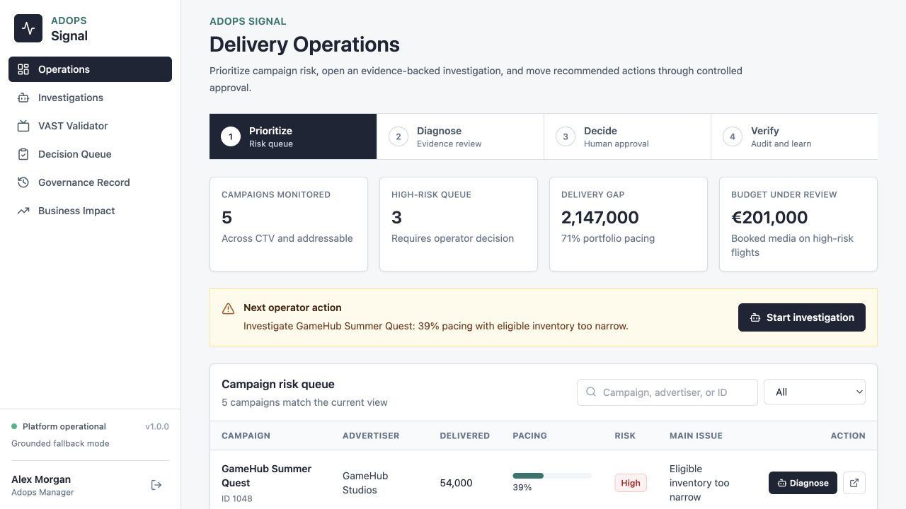
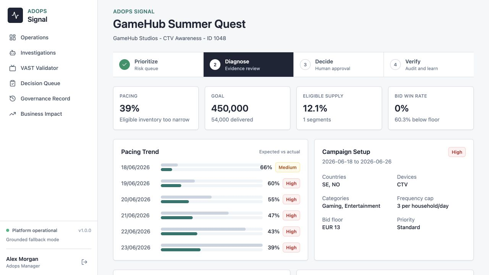
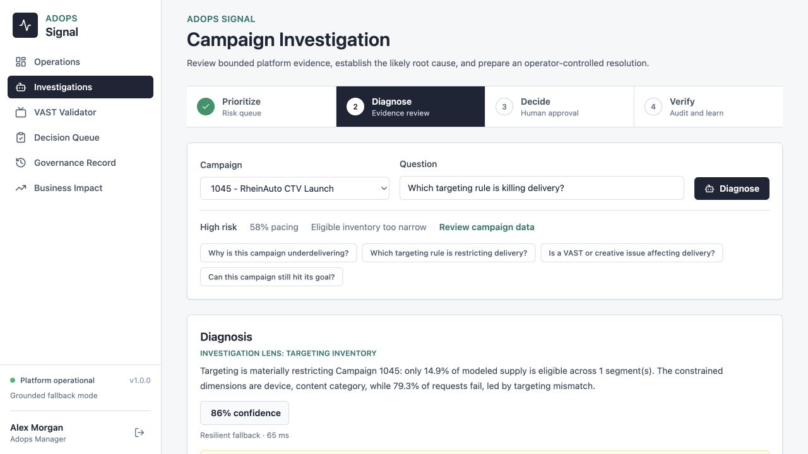
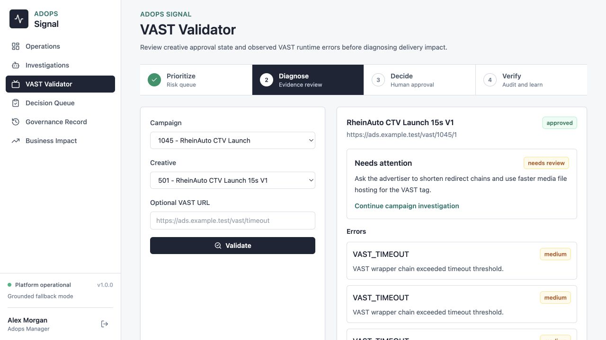
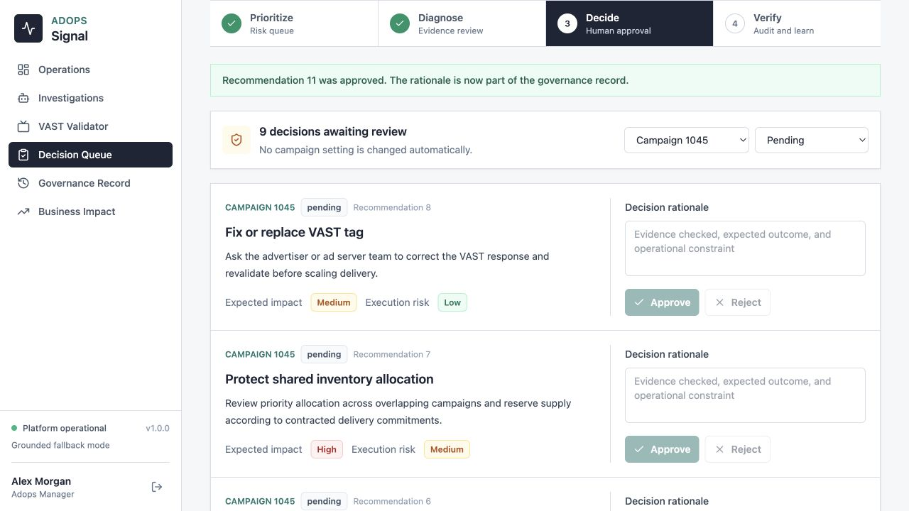
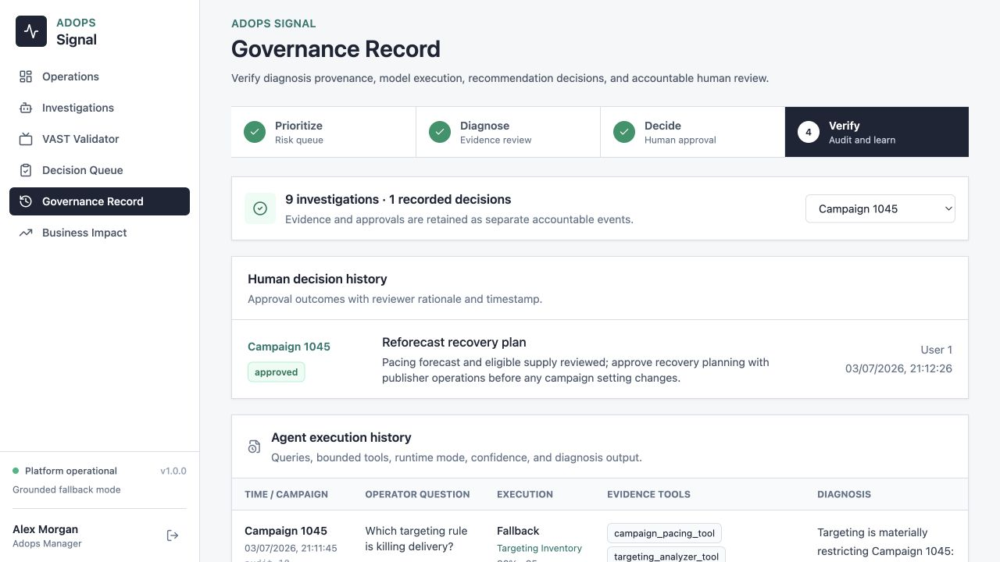
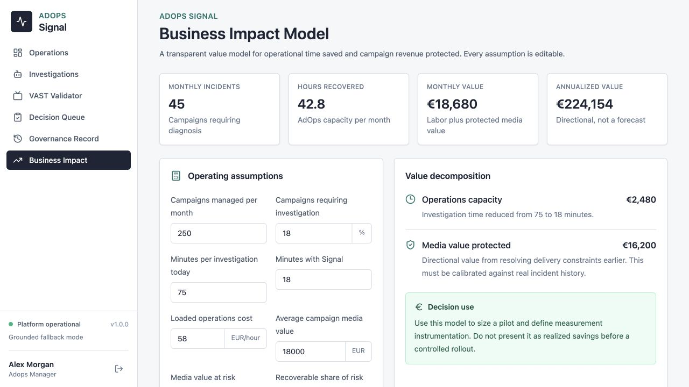
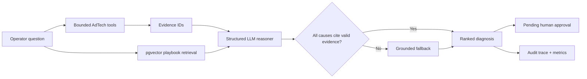
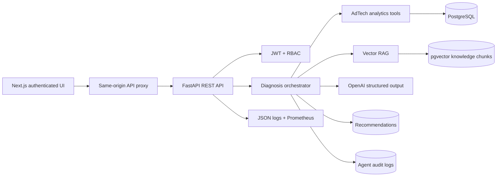

# AdOps Signal

### Evidence-grounded AI agent for CTV and addressable TV campaign troubleshooting

AdOps Signal helps advertising operations teams move from **“this campaign is behind”** to an inspectable root cause and an approved recovery action. It combines bounded AdTech analytics tools, vector-retrieved operating playbooks, structured LLM reasoning, evidence validation, human approval, and an audit trail.

This is a working product case study, not a chat interface placed over hardcoded answers.

[Watch the two-minute narrated demo](./docs/demo/adops-signal-2-minute-demo.mp4) · [Read the PRD](./docs/PRD.md) · [Explore the system diagrams](./docs/SYSTEM_DIAGRAMS.md) · [Review the evaluation](./docs/EVALUATION_REPORT.md)

> **Demo mode:** The recorded demo intentionally runs without an API key and visibly reports `fallback`. Add `OPENAI_API_KEY` to activate structured `llm_rag` diagnosis. Both modes use the same evidence tools, provenance contract, approvals, and audit system.

## The Product Problem

CTV campaign underdelivery is a cross-system reasoning problem. An operator may need to combine:

- pacing against the flight plan;
- country, device, category, and publisher eligibility;
- available CTV or HbbTV supply;
- creative approval and VAST runtime quality;
- bid prices and publisher floors;
- frequency-cap pressure;
- late launch or missing delivery days;
- shared inventory consumed by higher-priority campaigns.

The operational cost is not only investigation time. Slow diagnosis puts booked media, client trust, and makegood exposure at risk.

## Product Thesis

An AI assistant is valuable here only if it:

1. retrieves facts from bounded platform tools;
2. distinguishes campaign evidence from general operating guidance;
3. cites evidence for every root cause;
4. exposes model mode, latency, sources, and confidence;
5. keeps delivery-impacting actions behind human approval;
6. remains available when the model provider is unavailable.

## End-To-End Operator Workflow

1. **Prioritize:** the delivery operations queue ranks campaigns by risk and pacing exposure.
2. **Diagnose:** bounded platform tools collect pacing, targeting, inventory, creative, VAST, and auction evidence before reasoning begins.
3. **Communicate:** the investigation produces a client-safe brief that omits internal pricing and raw technical traces.
4. **Decide:** an authorized operator approves or rejects each proposed action with a required rationale.
5. **Verify:** the governance record joins model execution, evidence provenance, confidence, human decision, reviewer, and timestamp.

These are implemented handoffs, not presentation-only concepts. A browser-tested workflow runs from Campaign 1048 in the risk queue through diagnosis, client brief, controlled approval, and the resulting audit record.

## Product Walkthrough

### Campaign health

Operators start with portfolio risk, not a blank chat box.



### Campaign operating context

Pacing, eligible supply, bid performance, creative state, and setup are visible before diagnosis.



### Evidence-backed diagnosis

The response contains ranked causes, evidence IDs, recommendations, confidence, tools called, retrieved playbooks, model mode, and latency.



### Creative quality

Approval state and runtime VAST quality remain separate. An approved asset can still require review because of timeout or media errors.



### Human decision control

Recommended changes enter a campaign-filtered queue. Approval or rejection requires operator rationale.



### Governance record

Agent traces and human decisions remain distinct, inspectable events.



### Business case

The value model is transparent and editable rather than presented as invented realized savings.



## Primary Users

| User | Decision supported |
|---|---|
| AdOps Manager | What is preventing delivery, and which action should we take? |
| Publisher Operations | Is the issue supply, request filtering, device mapping, or creative quality? |
| Customer Success | How do we explain the issue without exposing internal auction mechanics? |
| Product Manager | Which recurring failures deserve a platform investment? |

## How The Agent Works



### Tool layer

- Campaign pacing.
- Campaign setup and launch timing.
- Targeting eligibility.
- Inventory/request failure distribution.
- Portfolio-level high-priority inventory pressure.
- Creative approval and VAST validation.
- Bid/floor competitiveness.
- Vector documentation retrieval.

### Reasoning layer

When configured, `gpt-5.4-mini` receives compact campaign context, evidence IDs, and retrieved guidance. It must return the strict `GroundedDiagnosis` schema. Causes with invalid evidence references are discarded.

The model does not receive a database connection, credentials, or an action-execution tool.

### Availability fallback

Without a provider key, or when the provider fails, the application returns a clearly marked deterministic diagnosis. This is a resilience path, not the primary production reasoning mode.

## Architecture



More detail:

- [Architecture and quality attributes](./docs/ARCHITECTURE.md)
- [Block, sequence, trust, deployment, and fallback diagrams](./docs/SYSTEM_DIAGRAMS.md)
- [Agent prompts, RAG, guardrails, and compute decisions](./docs/AI_AGENT_DESIGN.md)

## Production Controls

- JWT authentication with issuer, audience, role, and expiration.
- Salted PBKDF2-SHA256 password storage.
- Role-gated recommendation approval and audit access.
- Pydantic request and structured model-output validation.
- Evidence IDs for root-cause provenance.
- Human approval for targeting, bid, frequency, inventory, flight, and creative changes.
- Required decision rationale with reviewer identity and timestamp.
- Client-safe summarization boundary.
- Request IDs, structured JSON logs, and Prometheus metrics.
- Liveness and database readiness endpoints.
- Alembic migration baseline.
- Seed-once hosted demo mode; production does not wipe data on restart.
- GitHub Actions quality gate for tests, builds, and containers.

## Evaluation

The repository contains 15 golden troubleshooting cases and 13 passing backend tests.

| Release metric | Current offline result | Floor |
|---|---:|---:|
| Golden root-cause recall | 100% | 90% |
| Evidence provenance coverage | 100% | 100% |
| Backend tests | 13 passing | 100% |
| Frontend production build | Passing | Passing |

These numbers measure the deterministic synthetic benchmark. They are not a claim of accuracy on customer incidents. A provider-specific LLM report requires an API key, repeated runs, and expert-labeled real incidents.

```bash
cd backend
pytest -q
python -m evals.run_evaluation
```

See [EVALUATION_REPORT.md](./docs/EVALUATION_REPORT.md) for coverage and limitations.

## ROI Hypothesis

The implemented `/impact` model estimates:

```text
operational capacity saved
  + media value protected through earlier intervention
```

With the editable demonstration assumptions, the directional result is approximately EUR 224k annual value. It is explicitly labeled as a hypothesis. A pilot must replace every assumption with observed incident and delivery data.

See [ROI_MODEL.md](./docs/ROI_MODEL.md).

## Local Setup

### Prerequisites

- Docker Desktop with Docker Compose.
- An OpenAI API key only if you want live LLM reasoning. The product works without one.

### Start

```bash
cp .env.example .env
docker compose up --build
```

Open:

- Product: [http://localhost:3000/dashboard](http://localhost:3000/dashboard)
- API health: [http://localhost:8000/health](http://localhost:8000/health)
- API readiness: [http://localhost:8000/ready](http://localhost:8000/ready)
- API docs in local mode: [http://localhost:8000/docs](http://localhost:8000/docs)
- Metrics: [http://localhost:8000/metrics](http://localhost:8000/metrics)

Demo sign-in:

```text
Email:    adops@demo.adops.local
Password: SignalDemo!2026
```

The credentials are intentionally limited to this synthetic portfolio environment. Replace them with SSO/OIDC in a real deployment.

### Enable LLM + RAG Mode

Edit `.env`:

```bash
OPENAI_API_KEY=your_key
OPENAI_MODEL=gpt-5.4-mini
RAG_EMBEDDING_PROVIDER=openai
```

Then rebuild:

```bash
docker compose up --build
```

`RAG_EMBEDDING_PROVIDER=local` keeps vector retrieval offline. `openai` uses `text-embedding-3-small`.

### Reset Synthetic Data

```bash
docker compose down -v
docker compose up --build
```

Development Compose intentionally uses `SEED_DEMO_DATA=true`. Hosted demo configuration uses `if-empty`; production should use `false`.

## Environment Variables

| Variable | Purpose |
|---|---|
| `DATABASE_URL` | PostgreSQL/psycopg connection |
| `JWT_SECRET` | Access-token signing secret |
| `AUTH_ENABLED` | Require authenticated product APIs |
| `SEED_DEMO_DATA` | `true`, `if-empty`, or `false` |
| `OPENAI_API_KEY` | Activates structured LLM diagnosis |
| `OPENAI_MODEL` | Configurable reasoning model |
| `RAG_EMBEDDING_PROVIDER` | `local` or `openai` |
| `FRONTEND_ORIGIN` | CORS allowlisted frontend |
| `API_BASE_URL` | Server-side frontend proxy target |

## API Example

Sign in:

```bash
curl -X POST http://localhost:8000/api/auth/login \
  -H "Content-Type: application/json" \
  -d '{"email":"adops@demo.adops.local","password":"SignalDemo!2026"}'
```

Use the returned token:

```bash
curl -X POST http://localhost:8000/api/agent/diagnose \
  -H "Authorization: Bearer YOUR_TOKEN" \
  -H "Content-Type: application/json" \
  -d '{"campaign_id":1045,"query":"Why is this campaign underdelivering?"}'
```

## Synthetic Failure Scenarios

The deterministic dataset contains:

1. Narrow targeting.
2. Missing companion asset and rejected creative.
3. VAST timeout.
4. Bid below floor.
5. Strict frequency cap.
6. Late campaign start.
7. Low CTV inventory by country.
8. Device-targeting mismatch.
9. Publisher category block.
10. High-priority campaign consuming shared inventory.

Volumes include five campaigns, twenty creatives, one thousand ad requests, five hundred impressions, three hundred bid responses, twenty VAST errors, and thirty pacing snapshots.

## Public Deployment

`render.yaml` defines:

- managed PostgreSQL;
- backend Docker service with migrations, seed-once demo data, and readiness checks;
- frontend Docker service using the same-origin API proxy;
- generated JWT secret;
- optional OpenAI key.

After importing the repository as a Render Blueprint:

1. Set backend `FRONTEND_ORIGIN` to the frontend public URL.
2. Set frontend `API_BASE_URL` to the backend public URL.
3. Optionally add `OPENAI_API_KEY`.
4. Deploy and verify `/ready`.

A permanent public URL cannot be created from source code alone; it requires the repository owner’s cloud account and billing/terms acceptance.

## Product Documentation

| Document | Decision it captures |
|---|---|
| [PRD](./docs/PRD.md) | Problem, users, scope, principles, metrics, rollout |
| [Product strategy](./docs/PRODUCT_STRATEGY.md) | Wedge, buyer, differentiation, monetization, roadmap |
| [Use cases](./docs/USE_CASES.md) | Priorities, flows, automation boundaries |
| [Wireframes](./docs/WIREFRAMES.md) | Information architecture and interaction intent |
| [Architecture](./docs/ARCHITECTURE.md) | Quality attributes, security, operations, deployment |
| [System diagrams](./docs/SYSTEM_DIAGRAMS.md) | Block, sequence, trust, deployment, fallback |
| [AI design](./docs/AI_AGENT_DESIGN.md) | Model boundary, prompts, RAG, guardrails, evaluation |
| [Evaluation](./docs/EVALUATION_REPORT.md) | Golden set, quality floor, measured limitations |
| [User research](./docs/USER_RESEARCH.md) | Five-participant study and evidence log |
| [ROI model](./docs/ROI_MODEL.md) | Value formula, assumptions, pilot measurement |
| [Demo script](./docs/DEMO_SCRIPT.md) | Two-minute walkthrough |

## Research Status

No genuine customer interviews are claimed. The repository includes a ready-to-run five-participant study, recruitment targets, usability tasks, measures, evidence log, and decision rules. Fabricated interview quotes would contradict the evidence-first product strategy.

## Roadmap

### Connected pilot

- Read-only Metro Exchange, ad server, SSP, and VAST-provider integrations.
- Data freshness and lineage indicators.
- Historical incident import and expert labeling.
- Operator feedback capture on every diagnosis.

### Assisted optimization

- Delivery recovery simulation.
- Staged campaign changes with rollback.
- Approval integration with platform permissions.
- Proactive risk alerts.

### Product intelligence

- Cross-campaign failure trends.
- Publisher and creative quality signals.
- Recurring incident clusters for product prioritization.
- Model and prompt performance by incident type.

## Known Limitations

- Synthetic data only.
- No genuine user interviews completed yet.
- No live model benchmark without an API key.
- VAST checks use controlled synthetic validation rather than fetching arbitrary tags.
- Demo authentication is not enterprise SSO.
- No direct mutation of live campaign settings.
- Public deployment still requires the repository owner to connect a cloud account.

## Why This Project Matters

The work demonstrates the full AI-product loop: select a commercially meaningful AdTech problem, define the user and decision, design the human boundary, translate it into a technical system, build the working prototype, instrument quality and value, state what is unvalidated, and provide a credible path from shadow mode to controlled automation.
