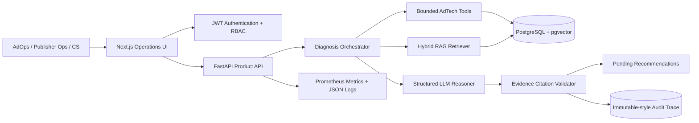
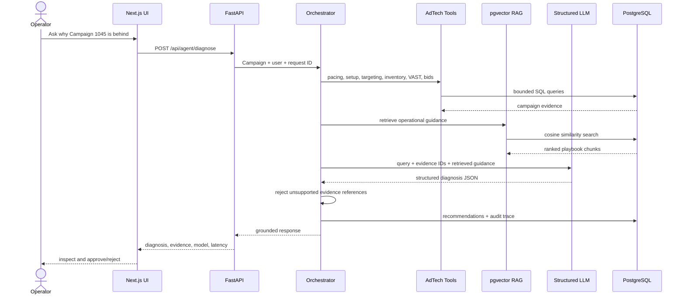
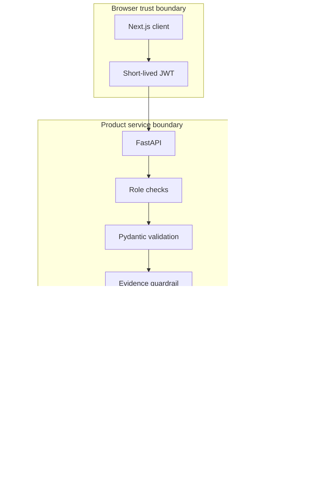
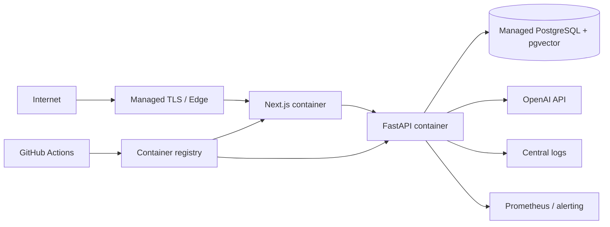
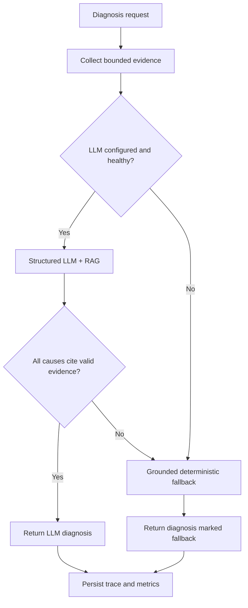

# System Diagrams

## Product Block Diagram

```mermaid
flowchart LR
    User["AdOps / Publisher Ops / CS"] --> Web["Next.js Operations UI"]
    Web --> Auth["JWT Authentication + RBAC"]
    Web --> API["FastAPI Product API"]
    API --> Orchestrator["Diagnosis Orchestrator"]
    Orchestrator --> Tools["Bounded AdTech Tools"]
    Tools --> PG[("PostgreSQL + pgvector")]
    Orchestrator --> Retriever["Hybrid RAG Retriever"]
    Retriever --> PG
    Orchestrator --> LLM["Structured LLM Reasoner"]
    LLM --> Guardrail["Evidence Citation Validator"]
    Guardrail --> Recs["Pending Recommendations"]
    Guardrail --> Audit[("Immutable-style Audit Trace")]
    API --> Metrics["Prometheus Metrics + JSON Logs"]
```

## Agent Sequence

```mermaid
sequenceDiagram
    actor Operator
    participant UI as Next.js UI
    participant API as FastAPI
    participant Agent as Orchestrator
    participant Tools as AdTech Tools
    participant RAG as pgvector RAG
    participant Model as Structured LLM
    participant DB as PostgreSQL

    Operator->>UI: Ask why Campaign 1045 is behind
    UI->>API: POST /api/agent/diagnose
    API->>Agent: Campaign + user + request ID
    Agent->>Tools: pacing, setup, targeting, inventory, VAST, bids
    Tools->>DB: bounded SQL queries
    DB-->>Tools: campaign evidence
    Agent->>RAG: retrieve operational guidance
    RAG->>DB: cosine similarity search
    DB-->>RAG: ranked playbook chunks
    Agent->>Model: query + evidence IDs + retrieved guidance
    Model-->>Agent: structured diagnosis JSON
    Agent->>Agent: reject unsupported evidence references
    Agent->>DB: recommendations + audit trace
    Agent-->>API: grounded response
    API-->>UI: diagnosis, evidence, model, latency
    UI-->>Operator: inspect and approve/reject
```

## Trust Boundaries

```mermaid
flowchart TB
    subgraph Browser["Browser trust boundary"]
        UI["Next.js client"]
        Token["Short-lived JWT"]
    end
    subgraph Product["Product service boundary"]
        API["FastAPI"]
        RBAC["Role checks"]
        Validate["Pydantic validation"]
        Guard["Evidence guardrail"]
    end
    subgraph Data["Data boundary"]
        DB[("PostgreSQL")]
        Docs[("Operational playbooks")]
    end
    subgraph Provider["External AI provider"]
        LLM["OpenAI model"]
        Embed["Embedding model (optional)"]
    end

    UI --> Token --> API
    API --> RBAC --> Validate --> Guard
    Guard --> DB
    Guard --> Docs
    Guard -->|"Minimum necessary evidence; no secrets"| LLM
    Docs -->|"Chunks only"| Embed
```

## Deployment

```mermaid
flowchart LR
    Internet --> TLS["Managed TLS / Edge"]
    TLS --> Frontend["Next.js container"]
    Frontend --> Backend["FastAPI container"]
    Backend --> Database[("Managed PostgreSQL + pgvector")]
    Backend --> OpenAI["OpenAI API"]
    Backend --> Logs["Central logs"]
    Backend --> Metrics["Prometheus / alerting"]
    CI["GitHub Actions"] --> Registry["Container registry"]
    Registry --> Frontend
    Registry --> Backend
```

## Failure And Fallback Path

```mermaid
flowchart TD
    Start["Diagnosis request"] --> Tools["Collect bounded evidence"]
    Tools --> Available{"LLM configured and healthy?"}
    Available -->|Yes| LLM["Structured LLM + RAG"]
    LLM --> Valid{"All causes cite valid evidence?"}
    Valid -->|Yes| Result["Return LLM diagnosis"]
    Valid -->|No| Fallback["Grounded deterministic fallback"]
    Available -->|No| Fallback
    Fallback --> Result2["Return diagnosis marked fallback"]
    Result --> Audit["Persist trace and metrics"]
    Result2 --> Audit
```
