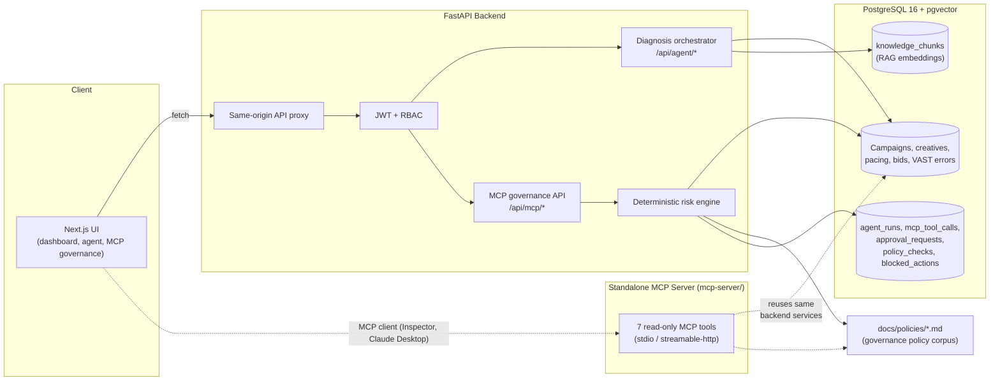
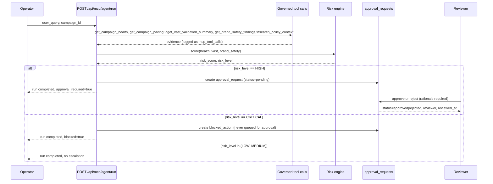

# Architecture

This document describes the system as it actually exists in this repository: a Next.js frontend, a FastAPI backend, a governed MCP tool surface (both embedded in the backend and as a standalone MCP server), and a PostgreSQL/pgvector data layer. All data is seeded and synthetic — see the [dataset disclaimer](#dataset-disclaimer).

## System Diagram



Two MCP surfaces exist by design, and they intentionally reuse the same backend service functions rather than duplicating analytics logic:

1. **Embedded governance API** (`backend/app/api/mcp.py`) — the product-facing surface. `POST /api/mcp/agent/run` composes campaign health, pacing, VAST, brand safety, and policy search into one governed, audited run, scores risk, and opens approvals/blocks. This is what the frontend's MCP Governance pages call.
2. **Standalone MCP server** (`mcp-server/`) — a real Model Context Protocol server (`FastMCP`) exposing the same read-only signals as individually callable MCP tools over stdio or Streamable HTTP, for use by an actual MCP client (MCP Inspector, Claude Desktop, or any other MCP host). It does not run the risk engine or write governance rows — see [MCP Tool Registry](./mcp-tool-registry.md).

## Frontend Routes

| Route | Purpose |
|---|---|
| `/` | Landing / login |
| `/dashboard` | Delivery risk queue across campaigns |
| `/campaigns/[id]` | Campaign detail: pacing, targeting, inventory, creative |
| `/agent` | Diagnosis workspace (bounded tools + RAG + LLM/fallback reasoning) |
| `/vast-validator` | Creative approval state and VAST error inspection |
| `/recommendations` | Legacy recommendation decision queue |
| `/audit-logs` | Agent diagnosis audit history |
| `/impact` | Editable ROI model |
| `/demo` | Public, read-only, pre-authenticated demo session |
| `/mcp-governance` | MCP governance executive dashboard (runs, approvals, tools, risk mix) |
| `/mcp-governance/agent` | Console to trigger a new governed MCP agent run |
| `/mcp-governance/runs/[run_id]` | Full run detail: tool call timeline, policy checks, approval, blocked action |
| `/mcp-governance/approvals` | Human-in-the-loop approval queue (approve/reject with rationale) |
| `/mcp-governance/tools` | MCP tool registry with live call counts and failure rates |

## Backend APIs

| Router | Base path | Responsibility |
|---|---|---|
| `app/api/auth.py` | `/api/auth` | Login, JWT issuance |
| `app/api/campaigns.py` | `/api/campaigns` | Campaign read models, pacing, targeting |
| `app/api/agent.py` | `/api/agent` | Legacy diagnosis orchestrator, tool registry listing |
| `app/api/recommendations.py` | `/api/recommendations` | Legacy recommendation approval workflow |
| `app/api/insights.py` | `/api/insights` | ROI/impact model |
| `app/api/mcp.py` | `/api/mcp` | MCP governance: runs, tool registry, approvals, summary |
| `app/api/system.py` | `/health`, `/ready`, `/metrics` | Liveness, readiness, Prometheus metrics |

MCP governance endpoints, in the order a demo exercises them:

| Endpoint | Method | Effect |
|---|---|---|
| `/api/mcp/agent/run` | `POST` | Runs the deterministic orchestration described below; writes `agent_runs`, `mcp_tool_calls`, `policy_checks`, and (conditionally) `approval_requests`/`blocked_actions` |
| `/api/mcp/runs` | `GET` | Lists recent agent runs |
| `/api/mcp/runs/{id}` | `GET` | Full run detail including tool call timeline |
| `/api/mcp/approvals` | `GET` | Lists approval requests |
| `/api/mcp/approvals/{id}/approve` | `POST` | Reviewer approval, requires rationale, role-gated |
| `/api/mcp/approvals/{id}/reject` | `POST` | Reviewer rejection, requires rationale, role-gated |
| `/api/mcp/tools` | `GET` | Tool registry with live call-count/failure-rate stats |
| `/api/mcp/summary` | `GET` | Aggregate counts for the governance dashboard |

## MCP Server Tools

The standalone server (`mcp-server/adops_signal_mcp/server.py`) exposes 7 read-only tools over the MCP protocol. Full schemas, example inputs/outputs, and error contracts are in [MCP Tool Registry](./mcp-tool-registry.md); summary:

| Tool | Reads |
|---|---|
| `ping_adops_signal` | Server + database readiness |
| `get_campaign_health` | Pacing %, risk level, creative status, VAST error count, bid analysis |
| `get_campaign_pacing` | Latest + historical pacing snapshots, delivery trend |
| `get_vast_validation_summary` | Creative approval state, persisted VAST errors by code/severity |
| `get_brand_safety_findings` | Deterministic brand-safety findings from targeting, vertical, creative status |
| `get_recommendation_history` | Prior recommendations and reviewer decisions for a campaign |
| `search_policy_context` | Keyword search over `docs/policies/*.md` |

None of these tools mutate data. There is no MCP tool that changes a campaign, approves a recommendation, or writes budget/pacing/targeting — that boundary is intentional (see [Governance Model](./product-case-study.md#risk-engine)).

## Database Tables

Governance-specific tables (added for MCP governance; see `backend/alembic/versions/20260710_0004_mcp_governance.py`):

| Table | Role |
|---|---|
| `agent_runs` | One row per governed MCP investigation: query, campaign, status, risk score/level, final recommendation |
| `mcp_tool_calls` | One row per tool invocation within a run: tool name, input/output JSON, latency, status |
| `approval_requests` | HIGH-risk proposed actions pending human decision: proposed action, risk score, rationale, reviewer, decision timestamp |
| `policy_checks` | Policy documents matched during a run and the resulting governance outcome (`clear` / `review_required` / `approval_required` / `blocked`) |
| `blocked_actions` | CRITICAL-risk actions that were never queued for approval because they must not execute (e.g. a rejected creative) |

Existing product tables the MCP tools and risk engine read from: `campaigns`, `advertisers`, `publishers`, `creatives`, `vast_validation_errors`, `pacing_snapshots`, `inventory_segments`, `ad_requests`, `bid_responses`, `recommendations`, `users`, `knowledge_chunks` (pgvector embeddings for the separate RAG diagnosis path). No new product-data tables or migrations were added for this documentation pass.

## Risk Model

`backend/app/services/mcp_governance_service.py::_score_risk` computes an additive 0–100 score, capped, from three inputs:

```text
score  = pacing_risk_weight[health.risk_level]      # High=45, Medium=25, Low=8, Unknown=15
       + 25 if any creative is rejected
       + min(vast_error_count * 3, 15)
       + sum(finding_severity_weight[f] for f in brand_safety_findings)
                                                       # high=15, medium=8, low=3
```

Band thresholds:

| Score | Level | Effect |
|---|---|---|
| ≥ 85, or (rejected creative AND a high-severity finding) | `CRITICAL` | Action blocked; `blocked_actions` row written; never queued for approval |
| ≥ 60 | `HIGH` | `approval_requests` row written; pending human decision |
| ≥ 35 | `MEDIUM` | `policy_checks.result = "review_required"`; no escalation row |
| < 35 | `LOW` | `policy_checks.result = "clear"`; no escalation row |

This is a deterministic, inspectable rule engine, not a model call — every score is reproducible from the same seeded inputs, which is what makes the demo repeatable. See [`docs/policies/`](./policies/) for the governance policy corpus (brand safety, budget shift, human approval, VAST validation) that `search_policy_context` retrieves against and that motivates these weights.

## Approval Workflow



Role gates (`app/security.py::require_roles`): only `admin` or `adops_manager` can call `/api/mcp/approvals/{id}/approve` or `/reject`. Reads (`/runs`, `/approvals`, `/summary`, `/tools`) are open to `admin`, `adops_manager`, `product_manager`, and the read-only public demo role. Approving an already-decided request returns `409`, not a silent overwrite.

## Audit Trail

Every step of `run_agent_orchestration` writes a `MCPToolCall` row with tool name, input JSON, output JSON, status, and latency, in addition to the returned `tool_timeline` shown in the UI. Combined with the `agent_runs`, `approval_requests`, `policy_checks`, and `blocked_actions` rows, a full run is reconstructable after the fact: what was asked, what evidence was read, what the risk score was, what governance outcome followed, who reviewed it, and when. Nothing is deleted or overwritten — approval decisions update `approval_requests` in place but the originating `agent_run` and its tool calls are immutable history.

## Local Development Flow

```bash
cp .env.example .env
docker compose up --build
```

This starts three containers (`docker-compose.yml`): `db` (pgvector/pgvector:pg16), `backend` (FastAPI, migrates then seeds on boot when `SEED_DEMO_DATA=true`), and `frontend` (Next.js, proxies `/api/*` to the backend). The standalone MCP server (`mcp-server/`) is **not** part of Docker Compose — it runs in its own Python environment against the same database, because its dependency set (current MCP SDK, `pydantic>=2.11`) is intentionally kept separate from the pinned backend runtime. See [MCP Local Setup](./mcp-local-setup.md) for exact commands, and [Demo Script](./demo-script.md) for the walkthrough this environment is built to support.

## Dataset Disclaimer

All campaigns, advertisers, publishers, creatives, VAST errors, pacing snapshots, and policy documents are synthetic fixtures generated by `backend/seed.py` (`RANDOM_SEED = 1045`) for demonstration purposes. Nothing in this repository connects to a real ad server, SSP, DSP, or production customer data, and no claim is made of real production deployment or real customer usage — see [Known Limitations](../README.md#known-limitations).

## Quality Attributes

The architecture prioritizes evidence integrity, graceful degradation, auditability, and operator control ahead of model novelty.

| Attribute | Design response |
|---|---|
| Reliability | Provider fallback, health/readiness checks, database pre-ping |
| Security | JWT, PBKDF2 passwords, RBAC, security headers, CORS allowlist |
| Explainability | Evidence IDs, tools called, retrieved sources, prompt/model metadata |
| Operability | JSON logs, request IDs, Prometheus metrics, Docker health checks |
| Change safety | Pending approvals/recommendations, role-gated decisions, required rationale, reviewer, and timestamp |
| Portability | Docker Compose, PostgreSQL primary, SQLite test fallback |
| Evolvability | Provider abstraction, REST contracts, Alembic baseline |

## API Security

- Access tokens include user role, issuer, audience, and expiration.
- Passwords use salted PBKDF2-SHA256.
- Campaign and MCP-governance reads require authentication.
- Approval/recommendation mutations require AdOps Manager or Admin.
- Audit logs require AdOps Manager, Product Manager, or Admin.
- Production disables interactive API documentation.
- Secrets are environment variables and never committed.

For a real deployment, replace demo credentials with enterprise SSO/OIDC, rotate signing secrets, add a managed secret store, and stream approval events into the platform audit system.

## Observability

- `GET /health`: liveness.
- `GET /ready`: database readiness and AI mode.
- `GET /metrics`: Prometheus counters and latency histograms.
- `X-Request-ID`: accepted or generated on every request.
- JSON logs include timestamp, level, logger, message, and request ID.
- MCP tool calls and agent audits include model/mode, prompt version, latency, and (for legacy diagnosis) token counts.

## Data Lifecycle

Development Compose sets `SEED_DEMO_DATA=true`. Production must set it to `false`; otherwise startup would intentionally reset demo data. `start.sh` applies Alembic migrations before serving traffic.

## Deployment

Recommended production shape (not what is currently deployed — see [Known Limitations](../README.md#known-limitations)):

- Managed TLS and edge protection.
- Independently scalable frontend and backend containers.
- Managed PostgreSQL with pgvector and encrypted backups.
- Restricted outbound access to the selected model provider.
- Central logs, metrics, uptime checks, and alerting.
- CI builds and verifies both containers before deployment.

## Remaining Production Work

- Enterprise SSO and organization tenancy.
- Managed rate limiting and abuse protection.
- Secret manager integration.
- Point-in-time database recovery.
- OpenTelemetry traces.
- Real platform connectors and data freshness SLAs.
- Data retention and deletion policy.
- A running MCP server behind authenticated, rate-limited transport for external MCP clients (today's standalone server is a local-only milestone — see [MCP Local Setup](./mcp-local-setup.md)).
