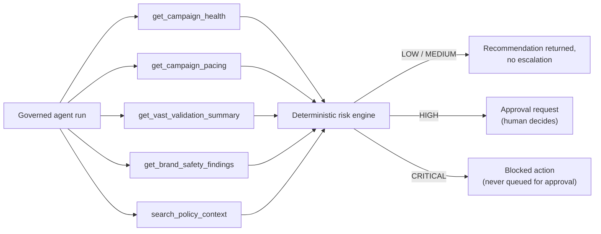

# Product Case Study: AdOps Signal MCP Governance

This is a governance control plane for AI-assisted AdOps decisions — not just a dashboard, not just a VAST validator, and not autonomous campaign execution. The agent investigates and proposes; a deterministic risk model decides how much scrutiny that proposal needs; and depending on the score, either nothing further happens, a human reviewer decides, or the action is blocked outright. Every step is logged.

## Executive Summary

AdOps teams are starting to give AI agents real tool access — query pacing, check creative validation, search policy, propose fixes. The unsolved product problem is not whether the agent finds the right answer; it's what happens the instant that answer implies an action with financial, contractual, or brand-safety consequences. This project is a working control plane for that moment: a governed MCP tool surface that lets an agent investigate a campaign using bounded, read-only tools, scores the resulting proposed action against a transparent risk model, and routes anything above a threshold to a human reviewer — with every tool call, risk score, and decision preserved in an audit trail.

It is built as a running system on a synthetic portfolio environment, not a slide deck or a chat wrapper. It is **not** deployed against real ad-server data and has **no real customer usage** — see [Limitations](#limitations).

## Problem

Three converging pressures make this a real product problem rather than a hypothetical one:

1. **Agents are getting tool access faster than governance is catching up.** MCP standardizes how an agent calls a tool; it says nothing about who should decide when a tool's output implies an action that shouldn't happen automatically.
2. **AdOps decisions carry real cost when wrong.** A wrongly approved budget shift, a creative that shouldn't have served, or a brand-safety miss on a regulated advertiser vertical are the kinds of mistakes that cost bookings and client trust — the [Product Strategy](./PRODUCT_STRATEGY.md) and [PRD](./PRD.md) for the broader SignalOps AI product describe this cost in detail.
3. **"The agent explained its reasoning" is not the same as "this action was authorized."** Most agent demos stop at explainability. Enterprises adopting agents need an accountable decision trail: what was proposed, how risky was it, who approved it, and when.

## Target Users

| User | Decision this system supports |
|---|---|
| AdOps Manager | Which proposed action is safe to approve, and on what evidence? |
| Platform/Trust & Safety Lead | Is agent tool usage across the platform inspectable and rate-bounded by risk? |
| Engineering Lead evaluating MCP | What does a governed MCP tool surface actually look like in code, not in theory? |
| Senior AI PM (interview audience) | Can this candidate design the control boundary around an agent, not just the agent itself? |

## Why MCP

Giving an agent tool access to real AdTech data is not the hard part — any function-calling harness does that. The hard part is making that tool access **governable**: enumerable (what can the agent call, and what does each call return), attributable (who approved what it proposed), and auditable (what actually happened, in order, with evidence).

The Model Context Protocol gives tool calls a standard shape — name, input schema, output contract. That standardization is what makes a generic tool registry, call log, and risk-scoring layer possible to build once and reuse across every future agent, instead of bespoke governance code per agent. It's also what lets the same read-only tools be consumed by more than one client — this product's own UI, or an external MCP host like Claude Desktop or MCP Inspector — without re-implementing the underlying business logic. See [MCP Local Setup](./mcp-local-setup.md) for the standalone server that proves this out.

Rather than build a more sophisticated diagnosis model, this project builds the **narrowest possible layer that makes agent tool use accountable**:

- Every tool the agent can call is read-only and enumerable in a registry (name, schema, output contract, category, risk level).
- Every proposed action is scored by a deterministic, inspectable risk function — not another model call — so the governance layer itself doesn't become a second black box.
- HIGH-risk actions stop at a human approval queue; CRITICAL-risk actions are blocked outright and never reach that queue, because some outcomes (a rejected creative serving) shouldn't be one reviewer's call to casually override.
- Every tool call, risk score, and human decision is written to durable governance tables, not just surfaced in a UI panel that disappears on refresh.

This is a deliberately narrow scope. It does not attempt autonomous optimization, write access to campaign settings, or a more capable reasoning model — see [Out of Scope in the PRD](./PRD.md#out-of-scope). The bet is that the accountability layer is the harder and more valuable problem to solve first.

## Product Workflow

This is the demo workflow a reviewer or operator actually walks through end to end:

1. **Prioritize.** The MCP Governance dashboard surfaces run volume, risk mix, pending approvals, blocked actions, and tool failure rates — where an operator starts, not where the story ends.
2. **Investigate.** An operator (or a scheduled trigger, in a connected pilot) submits a campaign to the Agent Console. The agent calls a fixed sequence of read-only MCP tools — campaign health, pacing, VAST validation, brand-safety findings, and policy-context search — each logged before any conclusion is reached.
3. **Score.** The deterministic risk engine turns that evidence into a single 0–100 score and a band (LOW/MEDIUM/HIGH/CRITICAL) — see [Risk Scoring](#risk-scoring).
4. **Route.** LOW/MEDIUM scores return a recommendation with no escalation. HIGH scores open a pending approval request. CRITICAL scores block the action outright and it never reaches a human queue.
5. **Decide.** For HIGH-risk runs, an authorized reviewer approves or rejects the proposed action in the Decision Queue with a required rationale — see [Human Approval](#human-approval).
6. **Verify.** The Governance Record joins the tool-call timeline, risk score, policy check, and human decision into one inspectable trace — see [Audit Trail](#audit-trail).

This is a controlled agent workflow, not autonomous campaign execution: nothing in this sequence mutates a live campaign, budget, or bid on its own. Full timed walkthrough of this same sequence: [Demo Script](./demo-script.md).

## Architecture

Two MCP-shaped surfaces exist, both built on the same backend service functions so behavior cannot silently diverge between them:

- A **standalone MCP server** (`mcp-server/`) using the official Python MCP SDK (`FastMCP`), runnable over stdio or Streamable HTTP and connectable from MCP Inspector or any MCP host (e.g. Claude Desktop). It exposes 7 read-only tools.
- An **embedded governance API** (`backend/app/api/mcp.py`) that composes those same signals into one deterministic, audited investigation (`POST /api/mcp/agent/run`), backed by five governance tables.

Full system diagram, frontend routes, backend API table, and database schema: [Architecture reference](./architecture.md). Full tool-by-tool documentation: [MCP Tool Registry](./mcp-tool-registry.md).



## Governance Model

The governance model rests on four pillars, each backed by a durable table, not just a UI panel:

1. **Enumerable tools.** Seven tools total, all read-only: campaign health, campaign pacing, VAST validation summary, brand-safety findings, recommendation history, policy-context search, and a system readiness ping. No tool executes the action it evaluates. The embedded registry additionally tracks live call counts, failure rates, and last-used timestamps per tool, because a governance system that can't report on the health of its own tools isn't actually governing them. Full schemas and example payloads: [MCP Tool Registry](./mcp-tool-registry.md).
2. **Deterministic risk scoring** over the evidence those tools return — see [Risk Scoring](#risk-scoring).
3. **A human approval gate** for anything scored HIGH, and an outright block for anything scored CRITICAL — see [Human Approval](#human-approval).
4. **An immutable audit trail** joining tool calls, risk score, policy check, and human decision — see [Audit Trail](#audit-trail).

No tool in this registry can mutate a campaign, budget, bid, or creative. That boundary is intentional: this is a governance design pattern for read-heavy agent investigation, not a claim that write-path automation has been solved — see [Limitations](#limitations) and [Future Roadmap](#future-roadmap).

## Risk Scoring

A deterministic, additive 0–100 scoring function (`backend/app/services/mcp_governance_service.py::_score_risk`), not a model judgment:

```text
score  = pacing_risk_weight[health.risk_level]      # High=45, Medium=25, Low=8, Unknown=15
       + 25 if any creative is rejected
       + min(vast_error_count * 3, 15)
       + sum(finding_severity_weight[f] for f in brand_safety_findings)  # high=15, medium=8, low=3
```

| Score | Band | Outcome |
|---|---|---|
| ≥ 85, or rejected creative + a high-severity finding | CRITICAL | Blocked; never queued for human approval |
| ≥ 60 | HIGH | Approval request opened; pending human decision |
| ≥ 35 | MEDIUM | Flagged `review_required` in the policy check; no escalation row |
| < 35 | LOW | Flagged `clear`; no escalation row |

Choosing a rule engine over an LLM-scored risk assessment was deliberate: the layer that decides whether a human needs to see something should be reproducible and auditable on its own terms, not another opaque inference call sitting on top of the first one. Weights are informed by, and `search_policy_context` retrieves against, the governance policy corpus in [`docs/policies/`](./policies/) (brand safety, budget shift, human approval, VAST validation policies).

## Human Approval

`POST /api/mcp/agent/run` for a HIGH-risk campaign (e.g. Campaign 1045, RheinAuto CTV Launch) creates a pending `approval_requests` row with the proposed action, risk score, risk level, and a generated rationale. Only `admin` or `adops_manager` roles can approve or reject (`POST /api/mcp/approvals/{id}/approve|reject`), and every decision requires a written rationale — there is no one-click approve with no reason recorded. Approving an already-decided request returns `409 Conflict` rather than silently overwriting the prior decision. Full sequence diagram: [Architecture → Approval Workflow](./architecture.md#approval-workflow).

## Audit Trail

Every tool call inside a governed run is written as an `mcp_tool_calls` row (tool name, input JSON, output JSON, status, latency) before any conclusion is reached. Combined with `agent_runs` (the run itself), `policy_checks` (which policy matched and what governance outcome followed), and `approval_requests`/`blocked_actions` (the escalation and its resolution), a complete run is reconstructable after the fact — this is what `GET /api/mcp/runs/{id}` and the `/mcp-governance/runs/[run_id]` page render. Nothing in this trail is deleted; approval decisions update the `approval_requests` row in place, but the originating run and its tool calls are immutable.

## Business Value

The pitch to a platform team is infrastructure, not a point feature: **every future agent given tool access inherits the same registry, risk scoring, approval gate, and audit trail**, instead of each new agent needing its own bespoke governance code. Concretely, this replaces:

- Manual "should I trust this AI suggestion" judgment calls with a consistent, explainable risk score.
- Undocumented Slack-thread approvals with a queryable, reviewer-attributed decision record.
- "We think the agent didn't do anything wrong" with "here is the immutable log of every tool call it made."

No ROI figure is claimed here — the broader product's [ROI model](./ROI_MODEL.md) is explicit that assumptions need replacing with observed incident data from a real pilot before being treated as a business case, and that discipline applies here too.

## Limitations

- **Synthetic data only.** Every campaign, advertiser, publisher, creative, VAST error, and pacing snapshot is generated by `backend/seed.py` (`RANDOM_SEED = 1045`). Nothing connects to a real ad server, SSP, or DSP.
- **No production deployment claim.** This is a portfolio-grade working prototype, not a system in production.
- **No real customer usage.** No genuine customer, incident, or usage data informs this build.
- **Deterministic risk engine, not learned.** The risk score is a fixed additive rule, tuned by hand against the policy corpus — it has not been validated against real incident outcomes.
- **Keyword policy search, not RAG.** `search_policy_context` scores keyword overlap across four markdown files; it explicitly reports `vector_db_used: false, llm_used: false` in its own output.
- **Local-only standalone MCP server.** `mcp-server/` runs manually via stdio or Streamable HTTP; there is no hosted, authenticated MCP endpoint for external clients.
- **No MCP resources or prompts.** Only tools are exposed today — see [MCP Tool Registry → Resources and Prompts](./mcp-tool-registry.md#resources-and-prompts).
- **Demo authentication, not enterprise SSO.** Credentials are fixed and documented for local use; a real deployment needs OIDC/SSO.
- **No write path.** By design, nothing in this system can mutate a campaign, budget, bid, or creative — which also means it has not been tested against the harder problem of governing an agent that *can* write.

## Future Roadmap

- **MCP resources.** A `campaign://{id}/health` resource scheme so an MCP client can browse campaign state directly rather than only calling tools.
- **MCP prompts.** Package the fixed five-tool investigative sequence as a reusable `diagnose-underdelivery` MCP prompt template, so any MCP client can trigger the same governed investigation, not just this product's own UI.
- **Hosted, authenticated MCP endpoint.** Move the standalone server from a local stdio/HTTP milestone to an authenticated, rate-limited deployment reachable by external MCP clients.
- **Real policy retrieval.** Replace keyword search with actual semantic retrieval over a reviewed, expanded governance policy corpus.
- **Write-path governance.** Extend the same registry/risk/approval/audit pattern to a tightly scoped write tool (e.g. pausing a campaign), as the real test of whether this governance model holds up once actions have direct consequences.
- **Connected pilot.** Read-only integration with a real ad server or SSP, so risk scoring and approval routing can be validated against real incident data instead of seeded fixtures.
